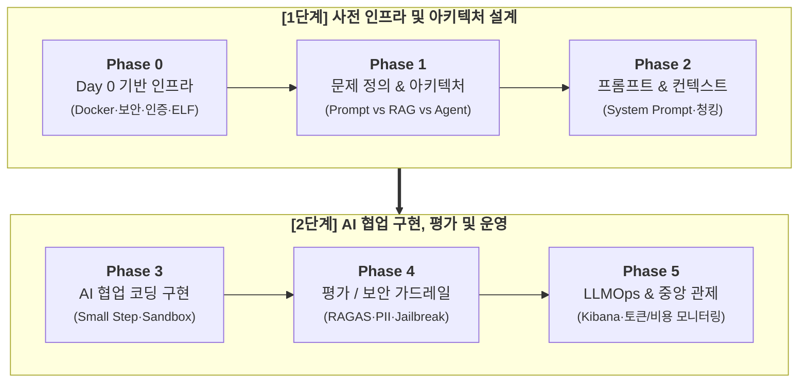

# 🤖 LLM Development Knowledge Center

> **LLM(대형 언어 모델) 기반 프로젝트 사전 필수 인프라(Day 0 Foundation), 개발 가이드라인, 아키텍처 설계, 보안 표준 및 AI 코딩 어시스턴트 룰셋 통합 지식베이스**

---

## 📌 한눈에 보는 지식 허브 (Quick Navigation)

### 🚨 [Day 0] 사전 필수 기반 환경 (Pre-requisite Foundation)
> 비즈니스 로직 및 프롬프트 개발 전, 시스템 안정성·보안·비용 통제를 위해 **반드시 최우선으로 구축되어야 하는 핵심 인프라**입니다.

| 문서명 | 역할 및 주요 내용 | 상태 | 바로가기 |
| :--- | :--- | :---: | :---: |
| **사전 필수 기반 환경 마스터 가이드** | 4대 인프라(Docker, 보안, 인증, 로깅) 총괄 아키텍처 및 준비도 체크리스트 | ✅ 완료 | 🏗️ [llm-foundation-setup.md](./llm-foundation-setup.md) |
| **ELF 중앙 로그 모니터링 가이드** | Elasticsearch + Fluent Bit + Kibana 파이프라인, 구조화 JSON 스키마, 알림 | ✅ 완료 | 📊 [llm-logging-and-observability.md](./llm-logging-and-observability.md) |
| **Docker 및 Agent Sandbox 가이드** | Multi-stage Dockerfile, docker-compose 통합 스택, 격리 샌드박스 | ✅ 완료 | 🐳 [llm-docker-and-sandbox.md](./llm-docker-and-sandbox.md) |
| **인증, 토큰 제어 및 보안 가이드** | JWT/API Key, Redis Token Bucket Rate Limiter, RAG RBAC, PII 자동 마스킹 | ✅ 완료 | 🛡️ [llm-auth-and-security.md](./llm-auth-and-security.md) |

---

### 📘 [Day 1+] 개발 라이프사이클 & 고도화 가이드

| 문서명 | 역할 및 주요 내용 | 상태 | 바로가기 |
| :--- | :--- | :---: | :---: |
| **LLM 개발 가이드라인 & AI 룰셋** | LLM 개발 6단계 라이프사이클, AI 코딩 어시스턴트 프로젝트 코딩 룰셋 | ✅ 완료 | 📘 [llm-guidelines.md](./llm-guidelines.md) |
| **지식베이스 마스터 로드맵** | 전 영역별 상세 구축 로드맵, 세부 스펙 및 문서화 현황 관리 | ✅ 완료 | 🗺️ [llm-roadmap.md](./llm-roadmap.md) |
| **RAG & 아키텍처 설계서** | Vector DB(Qdrant/pgvector), 청킹 전략, Hybrid Search & Reranking | ✅ 완료 | 📐 [llm-architecture-design.md](./llm-architecture-design.md) |
| **프롬프트 템플릿 카탈로그** | RTC-CF 5대 원칙, RAG 템플릿, Pydantic JSON 강제 추출 & Few-shot | ✅ 완료 | 📜 [prompt-templates-catalog.md](./prompt-templates-catalog.md) |
| **LLM 평가 및 검증 가이드** | RAGAS (Faithfulness/Relevance) 및 LLM-as-a-Judge 정량 평가 | ✅ 완료 | 🧪 [llm-eval-and-benchmarks.md](./llm-eval-and-benchmarks.md) |
| **Agent & Tool Calling 가이드** | Function Calling / Tool Use, ReAct 에이전트 및 무한 루프 제어 | 📝 예정 | 🤖 `llm-agent-and-tools.md` |
| **자동화 도구 기획 및 설계서** | 프로젝트 초기화(Init) 및 룰 준수 검증(Doctor) 자동화 CLI 도구 명세 | ✅ 완료 | 🛠️ [llm-automation-tool-spec.md](./llm-automation-tool-spec.md) |

---

## 🔄 LLM 개발 6단계 라이프사이클 (Lifecycle Overview)

| 단계 | 단계명 | 핵심 목표 및 주요 작업 | 참조 가이드 |
| :---: | :--- | :--- | :--- |
| **Phase 0** | 🏗️ **Day 0 기반 구축** | Docker/Sandbox, 시크릿 격리, Redis Rate Limiter, ELF 구조화 로깅 | `llm-foundation-setup.md` |
| **Phase 1** | 📐 **문제 & 기술 선택** | 최적 기술 선정 (Prompt vs RAG vs Fine-Tuning vs Agent) | `llm-guidelines.md` (Phase 1) |
| **Phase 2** | ✍️ **프롬프트/컨텍스트** | 역할/제약조건 명시(Role-Task-Context), 청킹 및 메타데이터 주입 | `prompt-templates-catalog.md` |
| **Phase 3** | 🤖 **AI 페어 프로그래밍** | 작은 단위 점진 개발(Small Step), 역질문 유도, 샌드박스 검증 | `llm-guidelines.md` (Phase 3) |
| **Phase 4** | 🛡️ **평가 & 보안 가드** | RAGAS 정량 평가, Prompt Injection 방어, 개인정보 유출 검증 | `llm-eval-and-benchmarks.md` |
| **Phase 5** | 📊 **LLMOps & 관제** | 실시간 토큰/비용 추이 관제, 지연시간(P99) 및 이상 탐지 알림 | `llm-logging-and-observability.md` |

---

## ⚡ AI 코딩 어시스턴트 핵심 룰 요약 (Core Rules Snapshot)

AI 어시스턴트(Gemini, Cursor, Copilot 등)가 코드를 생성하거나 수정할 때 **반드시 준수해야 하는 핵심 지침**입니다.

| 영역 | 표준 권장 사양 | 엄격 금지 사항 |
| :--- | :--- | :--- |
| **Backend** | Python 3.11+ / FastAPI, Java 21 / Spring Boot 3.x | 레거시 스택 및 미승인 외부 패키지 임의 추가 |
| **Architecture** | 계층형 아키텍처 (`Controller` ➔ `Service` ➔ `Repo`) | Controller 내 비즈니스 로직 혼재 |
| **Logging** | TraceID/토큰 메트릭 포함 구조화 JSON 로깅 | `print()`, `System.out.println()` 직접 사용 |
| **Sandbox** | 네트워크 차단 Docker 샌드박스 격리 실행 | 호스트 환경에서 Agent 코드 직접 실행 |
| **Security** | 환경변수/Secret Manager 기반 시크릿 관리 | API Key, DB 비밀번호 코드 내 하드코딩 |
| **API Schema** | `{ "success": true, "data": ..., "error": null }` | 비정형 텍스트 및 에러 스택트레이스 노출 |

---

## 🚀 시작하기 & 활용 방법 (How to Start)

1. **Step 1. 사전 기반 환경 점검:**
   - [`llm-foundation-setup.md`](./llm-foundation-setup.md)의 체크리스트에 따라 Docker 환경, ELF 로깅 스택, API 인증 및 보안 가드레일을 먼저 기동합니다.
2. **Step 2. AI Pair Programming 시:**
   - [`llm-guidelines.md`](./llm-guidelines.md)의 **Section 3(Project Coding Rules)**을 코딩 어시스턴트의 `.cursorrules` 또는 System Prompt로 활용합니다.
3. **Step 3. 신규 LLM 기능(RAG, Agent 등) 개발 시:**
   - [`llm-roadmap.md`](./llm-roadmap.md)를 참고하여 표준 스펙에 맞춰 개발을 진행합니다.

---

*본 지식베이스는 프로젝트 진행 및 기술 업데이트에 맞춰 지속적으로 업데이트됩니다.*
