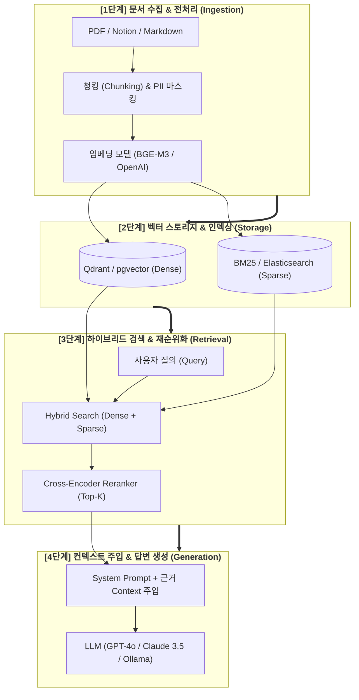

# 📐 RAG & 아키텍처 설계서 (Retrieval-Augmented Generation & Vector DB)

> **"환각을 없애고 사내 최신 지식에 기반한 답변을 생성하는 고성능 RAG 파이프라인 및 Vector DB 설계 가이드"**

---

## 1. RAG 5단계 표준 아키텍처 (Architecture Overview)



---

## 2. 청킹(Chunking) 전략 가이드

| 청킹 방식 | 적합한 문서 유형 | 권장 Chunk Size / Overlap | 장점 및 특징 |
| :--- | :--- | :--- | :--- |
| **Recursive Character** | 일반 텍스트, 블로그, 사규 | 500 ~ 1,000 chars / 100 overlap | 단락/문장 경계를 보존하며 범용적으로 우수 |
| **Markdown / Header Chunking** | 기술 문서, API 스펙, 위키 | Header 계층 기준 분할 | 소제목/문맥 정보를 메타데이터로 보존 가능 |
| **Semantic Chunking** | 대화록, 비정형 회의록 | 임베딩 유사도 급변 지점 기준 | 문맥의 의미적 전환점을 자동으로 포착 |

---

## 3. 임베딩 모델 선정 가이드

| 임베딩 모델 | 차원 (Dimensions) | 한국어 성능 | 비용 / 인프라 | 추천 적용 분야 |
| :--- | :---: | :---: | :--- | :--- |
| **BAAI / bge-m3** | 1024 | 🏆 **최상** (다국어/Dense+Sparse 동시 지원) | 오픈소스 (자체 GPU 호스팅) | 사내 프라이빗 온프레미스 RAG |
| **OpenAI text-embedding-3-small** | 1536 | **상** | $0.02 / 1M 토큰 (매우 저렴) | 빠른 SaaS 프로토타입 및 일반 RAG |
| **Upstage Solar Embedding** | 4096 | **최상** (한국어 도메인 특화) | 상용 API 과금 | 한국어 공공/금융 정밀 검색 |

---

## 4. Vector DB 엔진 비교 & 추천

| Vector DB | 주요 특성 및 장점 | 적합 사례 |
| :--- | :--- | :--- |
| **Qdrant (추천)** | Rust 기반 초고속 연산, 풍부한 Payload 필터링, 독립 실행 | 고성능 대규모 RAG 및 마이크로서비스 |
| **PostgreSQL + pgvector** | 기존 RDB 인프라 재활용, 트랜잭션(ACID) 일관성 | 기존 Postgres 사용 중인 엔터프라이즈 환경 |
| **ChromaDB** | 파이썬 네이티브 내장, 설정 없는 로컬 기동 | 빠른 로컬 개발 및 PoC 단계 |

---

## 5. RAG 보안 & Document-Level RBAC 메타데이터 필터링

검색 시 사용자의 접근 권한을 벗어난 문서 청크가 LLM 프롬프트에 주입되지 않도록 **Vector DB 검색 레벨에서 사전 필터링(Pre-filtering)**을 필수 적용합니다.

```python
from qdrant_client import QdrantClient
from qdrant_client.http import models

def search_with_rbac(client: QdrantClient, query_vector: list, user_roles: list, tenant_id: str):
    # Vector 검색 전 사용자 권한(RBAC) 및 테넌트 격리 필터 적용
    rbac_filter = models.Filter(
        must=[
            models.FieldCondition(key="tenant_id", match=models.MatchValue(value=tenant_id)),
            models.FieldCondition(key="allowed_roles", match=models.MatchAny(any=user_roles))
        ]
    )
    
    return client.search(
        collection_name="enterprise_knowledge",
        query_vector=query_vector,
        query_filter=rbac_filter,
        limit=5
    )
```

---

## 📋 RAG 아키텍처 준비도 체크리스트

- [ ] **청킹 & 임베딩 표준화:** 문서 유형별 청킹 전략 및 임베딩 모델(BGE-M3 등) 선정 완료
- [ ] **Vector DB 인프라 구축:** Qdrant 또는 pgvector 컨테이너 기동 및 컬렉션 스키마 생성 완료
- [ ] **Hybrid Search 구현:** Dense 벡터 검색 + Sparse(BM25) 키워드 검색 결합 완료
- [ ] **Reranker 적용:** Cross-Encoder(예: BGE-Reranker) 기반 최종 Top-K 선별 파이프라인 연동
- [ ] **Document-Level RBAC 검증:** 사용자 권한별 검색 격리 및 메타데이터 필터링 검증 완료
