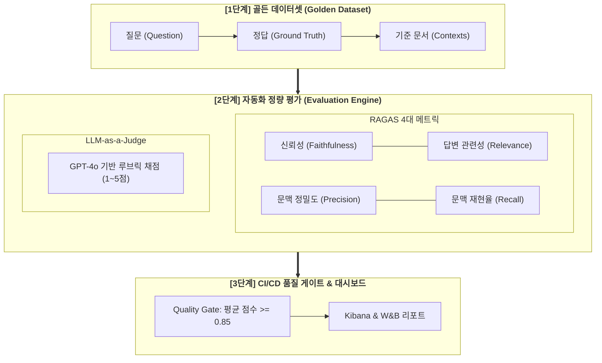

# 🧪 LLM 평가 및 검증 가이드 (LLM Evaluation & Benchmarks)

> **"느낌(Vibe check)에 의존하는 개발에서 벗어나, RAGAS 메트릭과 LLM-as-a-Judge로 답변 품질과 신뢰성을 정량 검증하는 평가 체계"**

---

## 1. LLM 평가 체계 개요 (Evaluation Framework)



---

## 2. RAGAS 4대 핵심 메트릭 정의

| 메트릭 (Metric) | 측정 대상 및 정의 | 계산 기준 | 목표 임계치 |
| :--- | :--- | :--- | :---: |
| **Faithfulness (충실성/신뢰성)** | LLM 답변이 주어진 [Context]에만 근거하여 작성되었는가? (환각 측정) | 답변의 주장 중 Context에서 입증된 비율 | **$\ge 0.90$** |
| **Answer Relevance (답변 관련성)** | 생성된 답변이 사용자의 [Question]에 직접적으로 부합하는가? | 답변에서 역생성한 질문과 원 질문의 임베딩 유사도 | **$\ge 0.85$** |
| **Context Precision (문맥 정밀도)** | 검색된 청크 중 정답과 관련된 상위 청크의 순위 적합도 | Ground Truth와 일치하는 청크의 순위 가중치 | **$\ge 0.80$** |
| **Context Recall (문맥 재현율)** | 정답(Ground Truth)에 필요한 모든 정보가 검색 청크에 포함되었는가? | 정답의 문장 중 검색된 청크에 포함된 비율 | **$\ge 0.85$** |

---

## 3. LLM-as-a-Judge 평가 루브릭 템플릿

```markdown
# Role: 평가 전문가 (LLM Judge)
당신은 LLM 생성 답변의 품질을 채점하는 엄격한 평가관입니다. 아래 제공된 [사용자 질문], [참조 근거], [생성 답변]을 검토하고 1~5점 척도로 평가하세요.

# 채점 기준 (Rubric):
- 5점: 환각이 전혀 없으며, 근거 문서에만 기반하여 질문에 완벽하고 명확하게 답변함.
- 4점: 대부분 정확하나 사소한 부연 설명이 포함됨.
- 3점: 질문에 대답했으나 일부 중요한 세부 정보가 누락됨.
- 2점: 질문의 의도를 오해했거나 근거 문서에 없는 사소한 추측(환각)이 포함됨.
- 1점: 완전히 거짓된 정보(치명적 환각)이거나 무관한 답변을 출력함.

# Output Format (JSON):
{
  "score": 5,
  "reason": "근거 문서의 조항을 정확히 인용하여 환각 없이 답변을 생성함."
}
```

---

## 4. Python RAGAS 평가 자동화 코드 예시

```python
from datasets import Dataset
from ragas import evaluate
from ragas.metrics import faithfulness, answer_relevance, context_precision, context_recall

def run_rag_evaluation(eval_samples: list):
    # eval_samples: [{"question": ..., "answer": ..., "contexts": [...], "ground_truth": ...}]
    dataset = Dataset.from_list(eval_samples)
    
    score_results = evaluate(
        dataset=dataset,
        metrics=[
            faithfulness,
            answer_relevance,
            context_precision,
            context_recall
        ]
    )
    
    print("📊 RAGAS Evaluation Results:")
    print(score_results)
    return score_results
```

---

## 📋 LLM 평가 체계 준비도 체크리스트

- [ ] **골든 데이터셋 확보:** 50~100개의 대표 질문/정답/참조문서 데이터셋 구축 완료
- [ ] **RAGAS 파이프라인 연동:** Faithfulness 및 Answer Relevance 자동 산출 파이프라인 구축
- [ ] **LLM-as-a-Judge 루브릭 확정:** 1~5점 채점 기준 및 JSON 평가 프롬프트 구성 완료
- [ ] **CI/CD Quality Gate 연동:** 배포 전 평가 점수 기준치(0.85 이상) 검증 자동화
