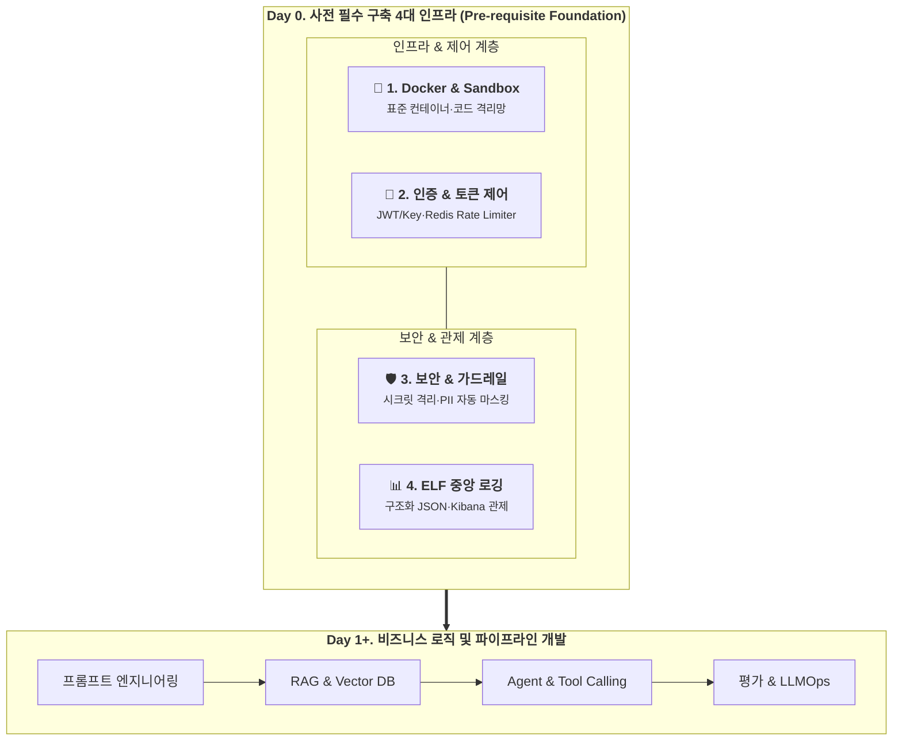
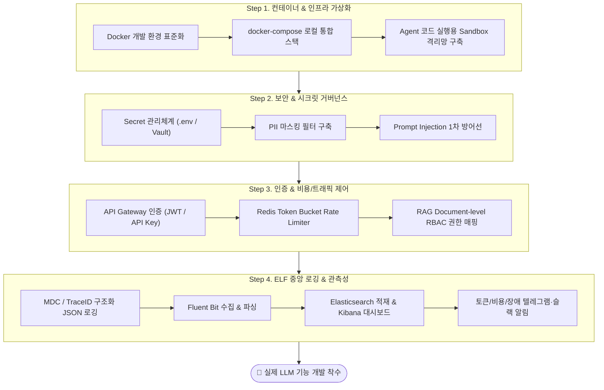

# 🏗️ LLM 사전 필수 기반 환경 구축 가이드 (Day 0 Foundation Guide)

> **"비즈니스 로직과 프롬프트를 작성하기 전, 시스템 안정성·보안·비용 제어를 위해 반드시 먼저 구축해야 하는 4대 핵심 인프라 가이드"**

---

## 1. 개요 (Overview)

LLM(대형 언어 모델) 애플리케이션 개발은 일반적인 웹 애플리케이션 개발과 근본적으로 다릅니다.  
API 호출 비용이 발생하고, 모델의 비결정적(Non-deterministic) 특성으로 인해 예상치 못한 출력이나 보안 위협(Prompt Injection, PII 유출 등)이 발생할 수 있습니다.

따라서 **실제 LLM 연동 코드(프롬프트, RAG, Agent 로직)를 작성하기 전, 반드시 다음 4대 기반 인프라(Day 0 Foundation)를 최우선으로 구축**해야 합니다.

| 4대 선행 영역 | 핵심 구축 항목 | 주요 보호 및 기대 효과 |
| :--- | :--- | :--- |
| 🐳 **1. Docker & Sandbox** | Multi-stage Dockerfile, docker-compose 통합 스택, 격리 샌드박스 | 호스트 시스템 침해 방지 및 환경 표준화 |
| 🔐 **2. 인증/인가·제어** | API Key/JWT 인증, Redis Token Bucket Rate Limiter, RAG RBAC | 무단 접근 차단 및 토큰 과금 비용 폭탄 방지 |
| 🛡️ **3. 보안 & 가드레일** | Secret Manager 격리, PII 실시간 자동 마스킹, Prompt Injection 방어 | 사내 민감정보 유출 차단 및 악의적 프롬프트 방어 |
| 📊 **4. ELF 중앙 로깅** | Fluent Bit + Elasticsearch + Kibana, 구조화 JSON 로깅 (TraceID/MDC) | 실시간 토큰/비용 추적 및 장애 즉각 식별 |

---

## 2. 4대 선행 인프라 구축 워크플로우

---

## 3. 사전 구축 필수 영역별 핵심 체크리스트 & 상세 문서

### 🐳 1. Docker 사용 및 샌드박스 격리 (Containerization & Sandboxing)
- **상세 가이드:** 📘 [`llm-docker-and-sandbox.md`](./llm-docker-and-sandbox.md)
- **핵심 목표:**
  - 백엔드, Vector DB, 로컬 임베딩/LLM 서버(Ollama, vLLM)를 단일 `docker-compose` 명령으로 재현 가능한 환경 구성.
  - Multi-stage 빌드 및 Non-root 사용자로 컨테이너 보안 강화.
  - **LLM Agent가 임의 코드를 실행할 때 호스트 시스템을 보호하기 위한 무권한/네트워크 차단 Docker Sandbox 격리 환경 필수 구축.**

### 🛡️ 2. 보안 및 컴플라이언스 (Security, Secrets & Guardrails)
- **상세 가이드:** 📘 [`llm-auth-and-security.md`](./llm-auth-and-security.md)
- **핵심 목표:**
  - LLM API 키(OpenAI, Gemini, Anthropic 등) 및 DB 비밀번호의 저장소 유출 절대 방지 (Secret Manager, `.gitignore`, GitLeaks).
  - 프롬프트에 주민번호, 전화번호, 이메일, 계좌번호 등 개인정보(PII) 유입 시 사전 자동 마스킹 (Microsoft Presidio 연동).
  - 악의적인 프롬프트 주입(Prompt Injection / Jailbreak)을 차단하는 시스템 프롬프트 구문 분리 및 가드레일.

### 🔑 3. 인증, 인가 및 비용 통제 (Authentication, Rate Limiting & RBAC)
- **상세 가이드:** 📘 [`llm-auth-and-security.md`](./llm-auth-and-security.md)
- **핵심 목표:**
  - API Gateway / Auth Layer를 통한 클라이언트 인증(JWT / API Key).
  - **비용 폭탄 방지:** Redis 기반 Rate Limiting (RPM: 분당 요청 수, TPM: 분당 토큰 수) 및 유저별 월간 토큰 쿼터(Quota) 제어.
  - **RAG 문서 권한 제어:** 사내 문서 검색 시 부서/직급별 권한(`role`)에 따라 검색 결과를 필터링하는 Document-level RBAC 구현.

### 📊 4. ELF/EFK 중앙 집중식 로그 모니터링 (Centralized Logging & Observability)
- **상세 가이드:** 📘 [`llm-logging-and-observability.md`](./llm-logging-and-observability.md)
- **핵심 목표:**
  - LLM 호출에 대한 구조화된 로그(TraceID, Prompt, Completion, Prompt Tokens, Completion Tokens, Latency, Cost, Model Name) 기록.
  - Fluent Bit 수집기 $\rightarrow$ Elasticsearch 저장 $\rightarrow$ Kibana 실시간 대시보드 구축.
  - 토큰 이상 급증, API 에러율 임계치 초과 시 실시간 알림(Telegram / Slack) 연동.

---

## 4. 선행 구축 완료 판정 체크리스트 (Day 0 Readiness Checklist)

본 체크리스트의 모든 항목이 `[x]` 처리되었을 때 비로소 LLM 비즈니스 로직 및 프롬프트 엔지니어링 개발을 시작합니다.

- [ ] **[Docker]** `docker-compose -f docker-compose.llm-dev.yml up -d` 실행 시 백엔드, Vector DB, 로깅 스택이 에러 없이 정상 기동된다.
- [ ] **[Docker Sandbox]** Agent 코드 실행기가 호스트 파일시스템 및 외부 네트워크에 접근할 수 없도록 격리되어 있다.
- [ ] **[Security]** 소스코드 및 형상관리(Git)에 API Key가 하드코딩되어 있지 않으며 환경변수 주입 체계가 검증되었다.
- [ ] **[Security]** PII 마스킹 모듈이 주민번호, 이메일, 카드번호를 정상적으로 `[REDACTED_PII]` 처리한다.
- [ ] **[Auth & Quota]** 인증되지 않은 사용자의 API 호출이 차단되며, 분당 토큰(TPM) 초과 시 HTTP 429(Too Many Requests)를 반환한다.
- [ ] **[Auth & RBAC]** RAG 검색 시 사용자 권한에 맞지 않는 보안 문서는 검색 결과에서 원천 배제된다.
- [ ] **[ELF Logging]** LLM API 호출 1건 발생 시 Kibana 대시보드에 TraceID, 토큰 사용량, 지연시간, 비용이 1초 이내로 인덱싱된다.
- [ ] **[Alerting]** LLM API 오류 발생 시 텔레그램/슬랙 채널로 즉시 에러 로그 알림이 전송된다.

---

*본 문서는 LLM 프로젝트의 성공적인 인프라 셋업을 위한 기본 헌장으로 작동합니다.*
