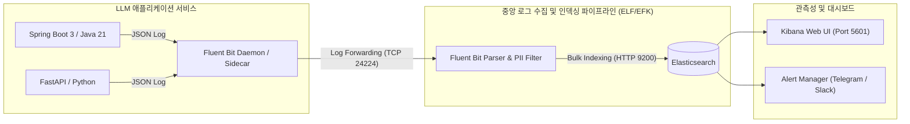

# 📊 ELF / EFK 기반 LLM 중앙 로그 모니터링 및 관측성 가이드 (LLM Logging & Observability)

> **"LLM 서비스의 블랙박스를 투명하게: 프롬프트·응답·토큰 비용·지연시간을 실시간으로 추적하고 이상 징후를 감지하는 중앙 집중식 로깅 인프라 가이드"**

---

## 1. 왜 LLM 서비스에서 중앙 로깅이 최우선인가? (Why Logging First?)

전통적인 웹 애플리케이션과 달리 LLM 서비스는 다음과 같은 특수성을 가집니다:

1. **비용 폭탄 위험:** 단 한 번의 무한 루프나 과도한 컨텍스트 주입으로 수백만 토큰($)이 순식간에 소비될 수 있습니다.
2. **비결정적 동작(Non-determinism):** 동일한 입력에도 다른 결과가 나오므로, 문제가 발생한 당시의 정확한 프롬프트와 LLM 파라미터(Temperature, Top_p 등)를 남겨두지 않으면 재현 및 디버깅이 불가능합니다.
3. **지연시간(Latency) 병목:** LLM API 호출은 수백 ms에서 수십 초까지 걸립니다. 어떤 구간(RAG 검색, 모델 추론, 도구 실행)에서 지연이 발생했는지 추적(Tracing)해야 합니다.
4. **보안 및 감사(Audit):** 악의적인 프롬프트 인젝션 시도, PII 유출 여부를 상시 감시해야 합니다.

따라서 **ELF/EFK(Elasticsearch + Logstash/Fluent Bit + Kibana) 중앙 로깅 시스템은 LLM 개발 시작 전 반드시 가동되어야 하는 필수 인프라**입니다.

---

## 2. LLM 중앙 집중식 로깅 아키텍처 (ELF / EFK Architecture)



---

## 3. LLM 표준 구조화 로그 스키마 (Structured JSON Schema)

모든 LLM 애플리케이션은 텍스트 형태의 단순 출력이 아닌, **아래 표준 JSON 스키마를 준수하여 로그를 출력**해야 합니다.

```json
{
  "@timestamp": "2026-08-10T17:30:00.123Z",
  "level": "INFO",
  "service_name": "ai-customer-assistant",
  "environment": "production",
  "trace_id": "c4b3a2-9871-4d3e-9012-abc123456789",
  "span_id": "span-llm-invoke-01",
  "user_id": "usr_99812",
  "session_id": "sess_20260810_01",
  
  "llm": {
    "provider": "google",
    "model": "gemini-1.5-pro",
    "temperature": 0.2,
    "max_tokens": 2048,
    "system_prompt": "You are a helpful customer assistant...",
    "user_prompt": "[REDACTED] 계좌 잔액 조회 요청",
    "completion": "고객님의 현재 잔액은 1,500,000원 입니다.",
    "finish_reason": "STOP",
    
    "usage": {
      "prompt_tokens": 340,
      "completion_tokens": 45,
      "total_tokens": 385,
      "estimated_cost_usd": 0.00042
    },
    
    "latency_ms": {
      "rag_retrieval_ms": 42,
      "model_inference_ms": 820,
      "total_duration_ms": 862
    }
  },
  
  "security": {
    "pii_detected": false,
    "prompt_injection_score": 0.01,
    "guardrail_status": "PASSED"
  },
  
  "error": null
}
```

---

## 4. 백엔드 구현 가이드: 구조화 로깅 연동

### 4.1 Java 21 / Spring Boot 3 구현 예제

#### 1) 의존성 추가 (`build.gradle`)
```groovy
dependencies {
    implementation 'net.logstash.logback:logstash-logback-encoder:7.4'
    implementation 'org.springframework.boot:spring-boot-starter-actuator'
}
```

#### 2) `logback-spring.xml` 설정 (Fluent Bit 전달용 JSON 콘솔 출력)
```xml
<?xml version="1.0" encoding="UTF-8"?>
<configuration>
    <appender name="JSON_CONSOLE" class="ch.qos.logback.core.ConsoleAppender">
        <encoder class="net.logstash.logback.encoder.LoggingEventCompositeJsonEncoder">
            <providers>
                <timestamp>
                    <timeZone>UTC</timeZone>
                </timestamp>
                <pattern>
                    <pattern>
                        {
                            "level": "%level",
                            "service_name": "spring-llm-service",
                            "thread": "%thread",
                            "logger": "%logger",
                            "trace_id": "%X{traceId:-N/A}",
                            "user_id": "%X{userId:-anonymous}",
                            "message": "%message",
                            "exception": "%ex"
                        }
                    </pattern>
                </pattern>
                <arguments/>
                <mdc/>
            </providers>
        </encoder>
    </appender>

    <root level="INFO">
        <appender-ref ref="JSON_CONSOLE" />
    </root>
</configuration>
```

#### 3) LLM 호출 감사 서비스 (`LlmAuditLogger.java`)
```java
package com.example.ai.logging;

import lombok.extern.slf4j.Slf4j;
import net.logstash.logback.argument.StructuredArguments;
import org.slf4j.MDC;
import org.springframework.stereotype.Component;

import java.util.Map;

@Slf4j
@Component
public class LlmAuditLogger {

    public void logLlmTransaction(
            String model,
            String prompt,
            String response,
            int promptTokens,
            int completionTokens,
            long durationMs,
            double costUsd) {

        Map<String, Object> llmData = Map.of(
            "provider", "google",
            "model", model,
            "prompt", maskPii(prompt),
            "completion", maskPii(response),
            "usage", Map.of(
                "prompt_tokens", promptTokens,
                "completion_tokens", completionTokens,
                "total_tokens", promptTokens + completionTokens,
                "estimated_cost_usd", costUsd
            ),
            "latency_ms", durationMs
        );

        // StructuredArguments를 통해 Elasticsearch에 중첩 JSON 필드로 자동 인덱싱됨
        log.info("LLM Transaction Completed", StructuredArguments.entries(Map.of("llm", llmData)));
    }

    private String maskPii(String text) {
        if (text == null) return "";
        // 기본 주민등록번호 / 카드번호 마스킹 (상세 마스킹은 보안 가이드 참조)
        return text.replaceAll("(?i)\\b\\d{6}-[1-4]\\d{6}\\b", "[REDACTED_RRN]");
    }
}
```

---

### 4.2 Python / FastAPI 구현 예제

#### 1) `structlog` 설정 및 LLM 미들웨어 (`logger_config.py`)
```python
import time
import uuid
import structlog
from fastapi import Request, Response
from starlette.middleware.base import BaseHTTPMiddleware

structlog.configure(
    processors=[
        structlog.processors.TimeStamper(fmt="iso"),
        structlog.stdlib.add_log_level,
        structlog.processors.JSONRenderer()
    ],
    logger_factory=structlog.stdlib.LoggerFactory(),
)

logger = structlog.get_logger()

class LlmLoggingMiddleware(BaseHTTPMiddleware):
    async def dispatch(self, request: Request, call_next):
        trace_id = request.headers.get("X-Trace-Id", str(uuid.uuid4()))
        structlog.contextvars.clear_contextvars()
        structlog.contextvars.bind_contextvars(
            trace_id=trace_id,
            service_name="fastapi-llm-service",
            user_id=request.headers.get("X-User-Id", "anonymous")
        )
        
        start_time = time.time()
        response = await call_next(request)
        duration_ms = int((time.time() - start_time) * 1000)
        
        logger.info("HTTP Request Processed", http_status=response.status_code, duration_ms=duration_ms)
        return response
```

---

## 5. 중앙 수집 인프라 구성 (Fluent Bit + Elasticsearch + Kibana)

### 5.1 `docker-compose.logging.yml`
```yaml
version: '3.8'

services:
  elasticsearch:
    image: docker.elastic.co/elasticsearch/elasticsearch:8.13.4
    container_name: llm-elasticsearch
    environment:
      - discovery.type=single-node
      - "ES_JAVA_OPTS=-Xms1g -Xmx1g"
      - xpack.security.enabled=false # 개발/내부망 기준 (운영 환경 시 TLS/Auth 활성화)
    ports:
      - "9200:9200"
    volumes:
      - es_data:/usr/share/elasticsearch/data
    networks:
      - llm-network
    restart: unless-stopped

  fluent-bit:
    image: fluent/fluent-bit:3.0.4
    container_name: llm-fluent-bit
    volumes:
      - ./fluent-bit/fluent-bit.conf:/fluent-bit/etc/fluent-bit.conf:ro
      - ./fluent-bit/parsers.conf:/fluent-bit/etc/parsers.conf:ro
      - /var/lib/docker/containers:/var/lib/docker/containers:ro
    ports:
      - "24224:24224"
      - "24224:24224/udp"
    depends_on:
      - elasticsearch
    networks:
      - llm-network
    restart: unless-stopped

  kibana:
    image: docker.elastic.co/kibana/kibana:8.13.4
    container_name: llm-kibana
    environment:
      - ELASTICSEARCH_HOSTS=http://elasticsearch:9200
    ports:
      - "5601:5601"
    depends_on:
      - elasticsearch
    networks:
      - llm-network
    restart: unless-stopped

volumes:
  es_data:

networks:
  llm-network:
    name: llm-network
    driver: bridge
```

### 5.2 `fluent-bit/fluent-bit.conf` 파이프라인 구성
```ini
[SERVICE]
    Flush         1
    Log_Level     info
    Parsers_File  parsers.conf

[INPUT]
    Name          forward
    Listen        0.0.0.0
    Port          24224

[FILTER]
    Name          parser
    Match         *
    Key_Name      log
    Parser        json_parser
    Reserve_Data  On

[OUTPUT]
    Name          es
    Match         *
    Host          elasticsearch
    Port          9200
    Index         llm-app-logs-%Y.%m.%d
    Type          _doc
    Suppress_Type_Name On
```

---

## 6. Kibana 필수 대시보드 및 지표 (Dashboard & Metrics)

Kibana(`http://<HOST_IP>:5601`)에 접속 후 `llm-app-logs-*` 인덱스 패턴을 생성하고 다음 핵심 시각화 위젯을 구성합니다.

| 시각화 위젯 | 메트릭 및 집계 기준 | 목적 |
| :--- | :--- | :--- |
| **실시간 토큰 소모량 추이** | `Sum(llm.usage.total_tokens)` / Date Histogram (10분 단위) | 비정상적인 토큰 급증 및 트래픽 스파이크 탐지 |
| **모델별 누적 추정 비용** | `Sum(llm.usage.estimated_cost_usd)` by `llm.model` | 모델별 비용 효율성 분석 및 과금 관리 |
| **LLM 응답 지연시간 (P50/P95/P99)** | `Percentiles(llm.latency_ms.model_inference_ms)` | SLA 준수 여부 및 모델 응답 속도 저하 감지 |
| **에러 및 HTTP 5xx 발생 비율** | `Count` where `level: ERROR` or `http_status >= 500` | 외부 LLM API 장애 및 쿼터 초과(429) 즉각 식별 |
| **보안 가드레일 차단 현황** | `Count` where `security.guardrail_status: BLOCKED` | 악의적 프롬프트 인젝션 및 PII 유출 시도 모니터링 |

---

## 7. 알림(Alerting) 연동 체계 (Telegram / Slack)

LLM 호출 중 이상 상황 발생 시 실시간 텔레그램/슬랙 알림을 발송하도록 설정합니다.

### 7.1 주요 알림 발송 조건
1. **토큰 폭탄 알림:** 단일 요청에서 `llm.usage.total_tokens > 8000` 발생 시
2. **외부 LLM API 오류:** `llm.finish_reason == "ERROR"` 또는 HTTP 429(Rate Limit Exceeded) 발생 시
3. **지연시간 초과:** `llm.latency_ms.model_inference_ms > 15000` (15초 초과) 지속 시
4. **보안 위반:** Prompt Injection 의심 점수 `> 0.8` 또는 PII 감지 시

### 7.2 텔레그램 알림 메시지 포맷 템플릿
```text
🚨 [LLM Alert] 이상 징후 감지
- 서비스: ai-customer-assistant (production)
- 원인: 토큰 사용량 임계치 초과 (9,420 Tokens)
- 모델: gemini-1.5-pro
- Trace ID: c4b3a2-9871-4d3e-9012-abc123456789
- 사용자: usr_99812
- 소요 시간: 12.4s | 추정 비용: $0.018
👉 Kibana 확인: https://kibana.internal.dev/app/r/s/trace_link
```

---

## 8. 결론 및 실천 지침

- [x] **로깅 없는 LLM 코드는 배포하지 않는다:** 모든 LLM 호출 전후에 Trace ID와 토큰 사용량을 남깁니다.
- [x] **로그에 개인정보(PII)를 남기지 않는다:** 마스킹 필터를 거친 안전한 프롬프트만 적재합니다.
- [x] **일 단위로 Kibana 비용 대시보드를 점검한다:** 예상치 못한 토큰 누수가 없는지 확인합니다.
